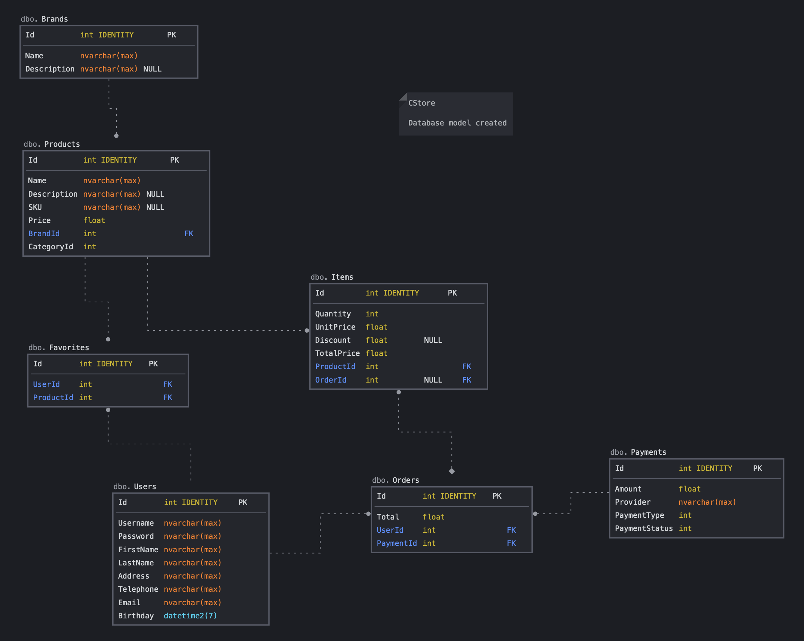

# CStore

## Description
CStore is a simple project for an E-commerce store management system developed in ASP.NET MVC using Entity framework and code first approach. The application has modules like inventory management, transaction management: sales and purchase, security and user management, and reporting services.

## Database

The Model Database is designed like:

## Technologies
* C# language;
* Entity Framework;
* .NET Core 6;
* ASP.NET Core API (Web Application);
* SQL Database;

## Concepts

* MVC Architecture Pattern;
* Code-First approach;
* Fluent API Interface;
